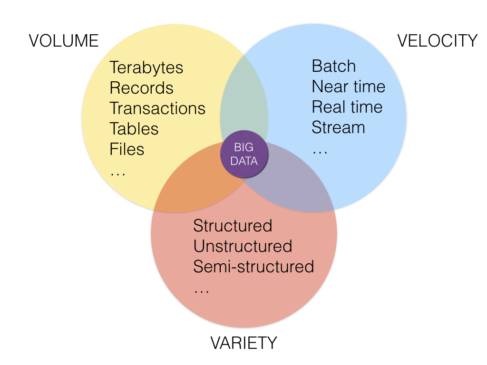
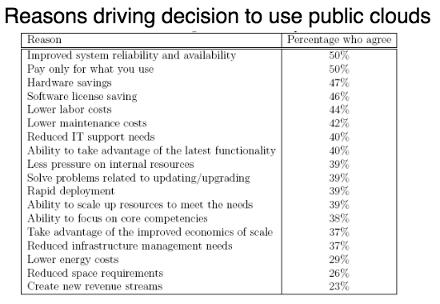

#  Intro to Cloud Computing & Big Data
Week 8 | Lesson 1.1

### LEARNING OBJECTIVES
*After this lesson, you will be able to:*
- understand cloud computing
- articulate use cases for cloud computing

### STUDENT PRE-WORK
*Before this lesson, you should already be able to:*
- know how to read and write data to databases
- experience analyzing data

### INSTRUCTOR PREP
*Before this lesson, instructors will need to:*
- Generate a brief slide deck
- Prepare any specific materials
- Provide students with additional resources

### ADDITIONAL BIG DATA PREP 
This week requires additional prep in order to successfully run lessons and labs related to cloud computing and big data: 

1. This Week:[Sign up for AWS Account & Credits](../AWS-instructions.md).
    - Note: Instructors will need to distribute individual URLs for the signup form. See linked instructions.
2. Next Week: [Download and install Virtual Machine](../VM-installation.md).
    - Note: This is a big file. Please reserve time to download and troubleshoot installation.

### LESSON GUIDE
| TIMING  | TYPE  | TOPIC  |
|:-:|---|---|
| 5 min | [Opening](#opening) | Opening |
| 20 min | [Introduction](#introduction) | Intro to Cloud Computing|
| 5 min | [Conclusion](#conclusion) | Conclusion |

## Opening (5 min)

 Now it's time to think about some major trends in the field, including common tools and problems that data scientists may encounter. 

 It is also time to take the tools you've learned to a new level by scaling up the size of datasets you can tackle. Today we start talking about Cloud Computing this week and then Big Data for the next two weeks.

**Check:** What do you think Big Data is?
> Answer: more data than your laptop can handle, more than 1 computer working together

__Cloud Computing__ 

__Big data__ is a hot topic nowadays. It refers to techniques and tools that allow to store, process and analyze  web-scale (multi-terabyte) datasets.

**Check:** Can you think of any dataset that satisfies the big data definition?
> Answer:
- amazon product catalogue
- google's gmail
- any large company server logs
- photos & images
- etc...

## Big Data Definition

Big data is a term used when the data exceeds the processing capacity of typical database. We need a big data analytics when the data grows quickly and we need to uncover hidden patterns, unknown correlations, and other useful information. There are three main features in big data (the 3 "V"s):

- **Volume**: Large amounts of data
- **Variety**: Different types of structured, unstructured, and multi-structured data
- **Velocity**: Needs to be analyzed quickly

Two approaches to Big Data: HPC and Cloud.

### High performance Computing (HPC)
Supercomputers are very expensive, very powerful calculators used by researchers to solve complicated math problems.

**Check:** Can you think of advantages and disadvantages of this configuration?
> Answer:

> pros:
- can perform very complex calculation
- centrally controlled
- useful for research and defense complicated math problems

> cons:
- expensive
- difficult to maintain
- scalability is bounded

#Intro to Cloud Computing

This week is focused on getting you all set up in Cloud Computing. 

Instead of one huge machine, what if we got a bunch of regular (commodity) machines?

**Check:** Can you think of advantages and disadvantages of this configuration?
> Answer:

> pros:
- cheaper
- easier to maintain
- scalability is unbounded (just add more nodes to the cluster)

> cons:
- only works with problems that are parallelizable
- small cpu power
- more I/O between machines

The term Big Data refers to the latter case, where commodity hardware with unlimited scalability is used to solve highly parallelizable problems.

## Interesting Case Study

Think Pair and Share: 
    Read through the article and discuss 
    [Pharma Research](http://arstechnica.com/business/2011/09/30000-core-cluster-built-on-amazon-ec2-cloud/)

## How does Cloud Computing Make a Difference?

Cloud computing institued major changes in mindset of leadership, teams, and technical capacity. It changed how technical teams and aspect interact with the rest of the organization, including: 
- IT Assets become Programmable Resources
- Technical resources are global, available, and unlimited in capacity
- Access to all levels of services
- Built in security
- Option to scale vertically and horizontally

[Architecting in the Cloud: AWS Best Practices](https://d0.awsstatic.com/whitepapers/AWS_Cloud_Best_Practices.pdf)

## Translate These Ideas Further for Organizations 

Read and keep these [11 Advantage of Cloud Computing for Businesses](https://www.skyhighnetworks.com/cloud-security-blog/11-advantages-of-cloud-computing-and-how-your-business-can-benefit-from-them/)

- Technical resources are disposible (instead of fixed)
- Flexible installationtiation of Compute Resources (like waterfall versus agile), including integration, monitoring, severless architecture
- Infrastructure is now code too 
- Automation
- Anti-Pattern data models and databases
- Removing single point failure
- Introducing Redundancy 

[Architecting in the Cloud: AWS Best Practices](https://d0.awsstatic.com/whitepapers/AWS_Cloud_Best_Practices.pdf)

Some reason for using the public clouds: 

[Cloud Infrastructure pg 45](http://docplayer.net/6426475-Chapter-3-cloud-infrastructure-cloud-computing-theory-and-practice-1.html)

## Conclusion (5 min)
In this class we discussed how cloud computing is tied with big data. We will implement big data techniques and algorithms next week. The rest of **this** week, the class will set up and configure AWS accounts. 

**Check:** now that you know how it works can you think of a more specific business application?
> Examples:
>
- process log files to find security breaches
- process medical records to assess spending
- process news articles to decide on investments

### ADDITIONAL RESOURCES
- [Architecting in the Cloud: AWS Best Practices](https://d0.awsstatic.com/whitepapers/AWS_Cloud_Best_Practices.pdf)
- [Cracking the Cloud - AWS Primer](http://arstechnica.com/uncategorized/2012/03/cracking-the-cloud-an-amazon-web-services-primer/)
- [Another AWS Tutorial](http://www.analyticsvidhya.com/blog/2016/05/complete-tutorial-work-big-data-amazon-web-services-aws/)

