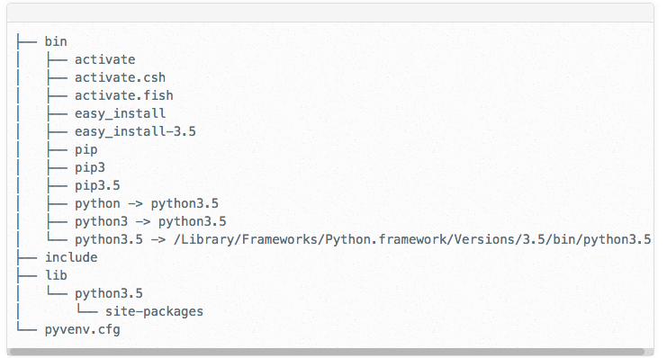

#  Introduction to Virtual Environments
Week 8 | Lesson 2.3

### LEARNING OBJECTIVES
*After this lesson, you will be able to:*
- under virtual environment for python
- learn how to effectively use virtual environments
- create and destroy virtual environments in your local environments
- save and pipe your environment to requirements.txt

### STUDENT PRE-WORK
*Before this lesson, you should already be able to:*
- install packages in their local environment
- open and interact with the terminal
- understand the file system on their machines

### INSTRUCTOR PREP
*Before this lesson, instructors will need to:*
- Generate a brief slide deck
- Prepare any specific materials
- Provide students with additional resources


### LESSON GUIDE
| TIMING  | TYPE  | TOPIC  |
|:-:|---|---|
| 5 min | [Opening](#opening) | Opening |
| 5 min | [Introduction](#intro-venv) | What are Virtual Environments?|
| 10 min | [Guided Practice](#why-venv) | Why virtual environments? |
| 5 min | [Demo](#details-venv) | Details of Virtual Environments |
| 10 min | [Demo](#types-venv) | How to Use Virtual Environments?|
| 15 min | [Independent Practice](#venv-save-load) | Portable Virtual Environments - Save and Load Configurations |
| 5 min | [Conclusion](#conclusion) | Conclusion |

<a name="opening"></a>
# Opening 

At its core, the main purpose of Python virtual environments is to create an isolated environment for Python projects. This means that each project can have its own dependencies, regardless of what dependencies every other project has.

<a name="introduction"></a>
# Introduction - What are Virtual Environments?

A Virtual Environment is a tool to keep the dependencies required by different projects in separate places, by creating virtual Python environments for them. It solves the “Project X depends on version 1.x but, Project Y needs 4.x” dilemma, and keeps your global site-packages directory clean and manageable.

For example, you can work on a project which requires Django 1.3 while also maintaining a project which requires Django 1.0.

[Python Docs](http://docs.python-guide.org/en/latest/dev/virtualenvs/)

<a name="why-venv"></a>
# Why Virtual Environments? 

Python, like most other modern programming languages, has its own unique way of downloading, storing, and resolving packages (or modules). 

While this has its advantages, there were some interesting decisions made about package storage and resolution, which has lead to some problems – namely how and where packages are stored.

More details on package management issues:[Real Python](https://realpython.com/blog/python/python-virtual-environments-a-primer/)

## So, why do all of these little details matter?

It’s important to know this because, by default, every project on your system will use these same directories to store and retrieve site packages (3rd party libraries). At first glance this may not seem like a big deal, and it isn’t really for system packages – packages part of the standard Python library – but it does matter for site packages.

**Check**: Think-Pair-Share
What are the compelling reason to use virtual environments for indivdiual projects?

>Answer: 
- python cannot distinguish between different 
versions of "site-packages" 
- not all projects will use the same version of packages or packages with the sample dependencies
- more control & less unexpected "breaks" in your code or applications

<a name="details-venv"></a>
# Example of directory with virtual environment
This is folder mapping is similar for python3 and python 2



<a name="types-venv"></a>
# How to Use Virtual Environments?

## Package Managers

virtual environment package for python is available through *pip* and *conda* package managers. [comparison between pip and conda virtualenv](http://conda.pydata.org/docs/_downloads/conda-pip-virtualenv-translator.html)

install through pip package manager
```bash
pip install virtualenv
```

install through conda package manager
```bash
conda install virtualenv
```

## Install virtual environment wrapper (pip install)

```bash
$ pip install virtualenvwrapper
$ export WORKON_HOME=~/Envs
$ source /usr/local/bin/virtualenvwrapper.sh
```
add the last two lines to ~/.bashrc/

## Create virtual environments

create new environments through pip package manager
```bash
cd $ENV_BASE_DIR
virtualenv $ENVIRONMENT_NAME
```

create new environments through conda package manager
```bash
conda create --name $ENVIRONMENT_NAME python
```

## Activate and deactive virtual environments

### Activate virtual environments 
	
pip package manager start
	
```bash
source $ENVIRONMENT_NAME/bin/activate
```
	
pip package manager with wrapper start
	
```bash
workon $ENVIRONMENT_NAME
```

conda package manager start
	
```bash
source activate $ENVIRONMENT_NAME
```

### Deactivate virtual environment

stop environments in any package manager
	
```bash
deactivate
```

### Remove virtual environment
remove conda virtual environment

```bash
conda-env remove -n $ENVIRONMENT_NAME
```
or, in some versions of anaconda

```bash
conda remove --all -n $ENVIRONMENT_NAME
```

## Indepedent Practice 

Compare the outputs of `which python` before and after your virtual environment is activated

See above for commands to activate and deactivate virtual environments.

<a name="venv-save-load"></a>
# Portable Virtual Environments

Virtual environments are also useful for keeping your environment consistent. This can help ensure consistency across installations, across deployments, and across developers.


It’s a good idea to “freeze” the current state of the environment packages. To do this, run

```
pip freeze > requirements.txt
```

Later it will be easier for a different developer (or you, if you need to re-create the environment) to install the same packages using the same versions:

```
pip install -r requirements.txt
```

Conda package manager 

```
conda list -e > req.txt
```

Good practice: upload requirements.txt to github project. However, exclude the virtual environment folder from source control by adding it to the ignore list.

<a name="conclusions"></a>
In this module, you learned to use an important tool for development and project management. 

**Check**: What other ways can this tool be helpful? 
> Potential answer: 
> - Working in teams
> - Working with multiple computers and cloud computing
> - Open source projects
