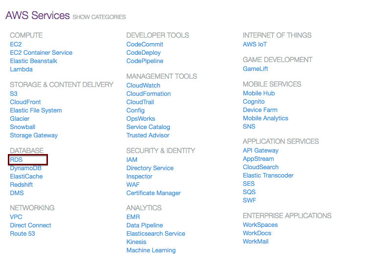

#  AWS Relational Database Service (RDS)
Week 8 | Lesson & Lab 1.3

### LEARNING OBJECTIVES
*After this lesson, you will be able to:*
- use AWS set up configuration for RDS
- launch a postgreSQL instance
- copy databases between rds, your local environment, and/or ec2 instance

### STUDENT PRE-WORK
*Before this lesson, you should already be able to:*
- sign up for AWS account
- sign in to your AWS console
- understand remote and local databases

### INSTRUCTOR PREP
*Before this lesson, instructors will need to:*
- Generate a brief slide deck
- Prepare any specific materials
- Provide students with additional resources

### AWS Credentials Required
Note: This lab requiress additional prep in order to run successfully:

1. [Sign up for AWS Account & Credits](../AWS-instructions.md).
    - Note: Instructors will need to distribute individual URLs for the signup form. See linked instructions.

### LESSON GUIDE
| TIMING  | TYPE  | TOPIC  |
|:-:|---|---|
| 5 min | [Opening](#opening) | Opening |
| 5 min | [Introduction](#introduction) | Intro to EMR |

<a name="opening"></a>
## Opening (5 min)

In less 1.2 we have discovered 2 very important AWS services: EC2 and S3. Today we will see how to launch relational databases in AWS

**Check:** Why are databases important to the data science process? 
> Answer: Databases are essential to warehousing, storaging, securing, sharing, and normalizing information

<a name="introduction"></a>
## Intro to RDS (5 min)

Amazon Relational Database Service (Amazon RDS) makes it easy to set up, operate, and scale a relational database in the cloud. It provides cost-efficient and resizable capacity while managing time-consuming database administration tasks, freeing you up to focus on your applications and business. Amazon RDS provides you six familiar database engines to choose from, including Amazon Aurora, Oracle, Microsoft SQL Server, PostgreSQL, MySQL and MariaDB.

**Check:** Where have you seen RDS in pass projects and class work?
> RDS databases were set up by GA in prios exercises and projects. You all have connected to an RDS database so the syntax is not new to you. The northwind and titantic data sets were turned into databases.

### RDS Pricing

RDS Pricing is based on the type of instances, number of instances if in a cluster, software license, storage space (instance and backup), and other parameters. Pricing is divided in tiers. 

**Exercise:**
Use the [AWS cost calculator](https://calculator.s3.amazonaws.com/index.html) to estimate the cost of a 5 GB instance of postgreSQL database with medium size instances `(m3.xlarge)`. 

**Check:** How does this impact costs, expenses, and operation for companies that want to store and use data?
> Answer: Database storage and maintainece are common overhead costs that business must incur to stay competitive and relevant.

<a name="guided-practice"></a>
# Guided Practice:
## RDS creation instance (15 min)

Let's create our first RDS instance together [tutorials provided by Amazon here](http://docs.aws.amazon.com/AmazonRDS/latest/UserGuide/CHAP_GettingStarted.html).

#### 1. Prerequisites

Let's first log-in to AWS and go to the RDS service page:



#### 2.  Launch postgreSQL instance 

Let's follow the tutorial by Amazon Part I: [Creating a PostgreSQL DB Instance](http://docs.aws.amazon.com/AmazonRDS/latest/UserGuide/CHAP_GettingStarted.CreatingConnecting.PostgreSQL.html)

Through the tutorial we will be: 
- Choosing the database type and version
- Size of the database / allocated storage
- View advanced settings 
- *Note: Choose development instead of production to remain in the free tier

<a name="ind-practice"></a>
# Independent Practice
## Connecting to a PostgreSQL DB Instance (15 min)

Let's follow the tutorial by Amazon Part II: [Connecting to a PostgreSQL DB Instance](http://docs.aws.amazon.com/AmazonRDS/latest/UserGuide/CHAP_GettingStarted.CreatingConnecting.PostgreSQL.html)

There are threes ways we focused on to connect to the database created in RDS:
1. pgAdmin (see image below for configuration examples)


2. psql 
	
in the command line, psql paramters for connections

```bash
$ psql --host=<DB instance endpoint> --port=<port> --username=<master user name> --password --dbname=<database name> 
```
	
psql example 

```bash
$ psql --host=mypostgresql.c6c8mwvfdgv0.us-west-2.rds.amazonaws.com --port=5432 --username=awsuser --password --dbname=mypgdb 
```

<a name="ind-practice"></a>
# Independent Practice
## Connecting between sources through the command line (20 min)

[Importing a PostgreSQL Database from an Amazon EC2 Instance](http://docs.aws.amazon.com/AmazonRDS/latest/UserGuide/PostgreSQL.Procedural.Importing.html)

If you have data in a PostgreSQL server on an Amazon EC2 instance and want to move it to a PostgreSQL DB instance, you can use the following process. The following list shows the steps to take. Each step is discussed in more detail in the following sections.

1. Create a file using pg_dump that contains the data to be loaded
2. Create the target DB instance in AWS
3. load the pg_dump output into AWS RDS endpoint. see the code below and in the tutorial.

```
psql \
   -f mydb2dump.sql \
   --host mypginstance.c6c8mntzhgv0.us-west-2.rds.amazonaws.com \
   --port 8199 \
   --username myawsuser \
   --password password \
   --dbname mydb2 
```


**Documentation Check:** What is the difference between pg_dump and pg_restore. Find the answer in the linked tututorial: [Importing a PostgreSQL Database from an Amazon EC2 Instance](http://docs.aws.amazon.com/AmazonRDS/latest/UserGuide/PostgreSQL.Procedural.Importing.html) 

Here is another way to copy localhost db to ec2. This will direct the .sql file to your ec2 instance not to rds

```bash
pg_dump -C -h localhost -U [localuser] -p [port] [database] | ssh -i ~/.ssh/[key].pem [user]@ec2-xx-xxx-xxx.compute-1.amazonaws.com -p9222 "cat > [location].sql"
```

<a name="independent-practice"></a>
## Exercise: Copy local database to the cloud  (20 min)

**Check:** What postgreSQL databases do you have on your localhost or local environment?

Using steps and documentation from [Importing a PostgreSQL Database from an Amazon EC2 Instance](http://docs.aws.amazon.com/AmazonRDS/latest/UserGuide/PostgreSQL.Procedural.Importing.html) copy a database from your localhost to rds. 

<a name="conclusion"></a>
## Conclusion (5 min)

Today we have learned how to start a RDS database instance and share data between different environments.

Consider terminating your instances now. 
