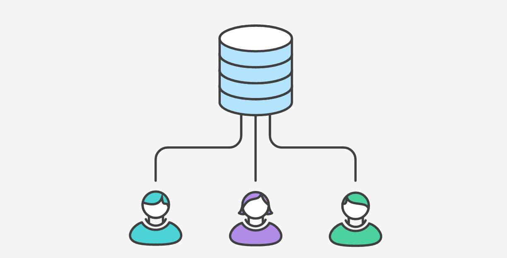
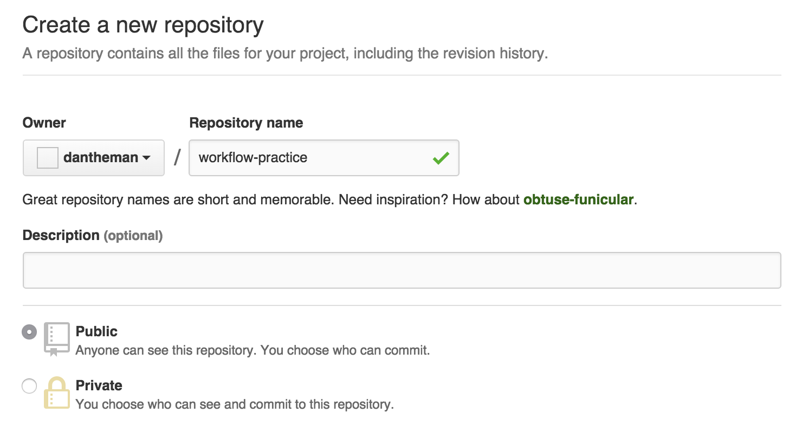
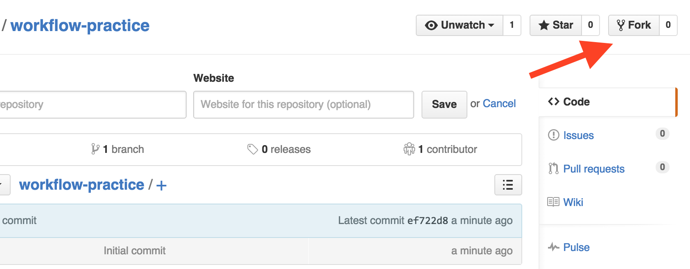
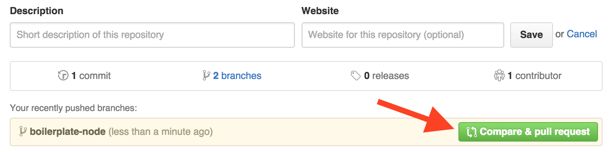
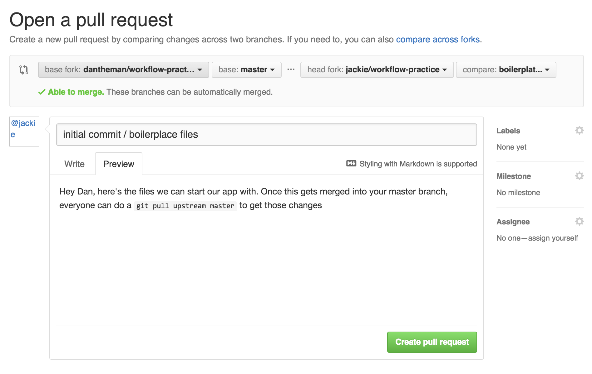

# Git Team Workflow

## Lesson Objectives

1. Understand the Centralized + Forked Git Team Workflow
2. Use Git branches to compartmentalize feature development
3. Submit pull requests from a fork to a central team repository
4. Keep local forked repo's sync'd

------

We've learned how to track changes to our projects with Git. We've also learned how to push those changes to a repository, and pull changes from a repository. We haven't done a whole lot of work with branches, but branches are necessary when working with teams.

If you're working on a solo project, with no collaborators, you can have whatever workflow suits you and the project. But when working with a team, it's important that everyone follows the same conventions:

1. name your branches descriptively but concisely
2. never work directly from the master branch
3. only the central repository owner can merge changes into the master branch (by approving pull requests)

> the Centralized Workflow uses a central repository to serve as the single point-of-entry for all changes to the project. Instead of `trunk`, the default development branch is called `master`and all changes are committed into this branch. This workflow doesn’t require any other branches besides `master`.

What does this look like? 


Let's practice the Git team workflow together, with a team of 3 people: Dan, Jackie, and Pat. 

First, we need to decide who will be in charge of the central repository that the team contributes to. Dan steps up to the plate and says "I got this!".

**Step 1**. Dan creates the central repository on GitHub, and called it `workflow-practice`



**Step 2**. Dan the project manager then clones the new central repository to his local machine.

``` bash

cd workspace
git clone <dans-central-repo-clone-url-goes-here>
```

**Step 3**. The other team members then **fork** Dan's repo from Github

 


**Step 4**. The team members can now **clone their forked version of the repo** to their local machines, then add the *central* repository as the `upstream`

``` bash
# Jackie, Lauren and Pat each do this from their own terminals:
cd workspace
git clone <jackies-forked-repo-clone-url-goes-here>
git remote add upstream <dans-central-repo-clone-url-goes-here>
```

### WHAT DOES THIS MEAN!!!???

It means that the team can run commands like `git push origin <branch-name-here>` to push their changes to their forked repository, AND can run `git pull upstream master` to RECEIVE all of the approved merged changes from the central repository to stay sync'd up.

**Step 5**. Dan says "Hey Jackie, I need you to start a Node app, would you mind creating the initial boilerplate files that we can start working off of? Jackie replies "Sure thing, Dan. I'm on it!"

The first thing Jackie needs to do is to create a branch for this task. She names the branch according to the task at hand `boilerplate-node`

``` bash
cd workflow-practice
git checkout -b boilerplate-node
```

Maybe when Jackie is finished creating the folder/file structure, it looks something like:

``` bash
.
├── app.js
├── controllers
├── models
│   └── User.js
├── package.json
├── routes
└── views
    └── users
        └── index.ejs
```

Jackie can commit these changes to her `boilerplate-node` branch:

``` bash
git add -A
git commit -m 'initial commit / boilerplace files'
```

**Step 6**. The other team members need to be able to get the same files / changes, so here's where the team workflow kicks in. Since Jackie cloned a **Fork** of the main repo, changes that are pushed will end up in the fork, not the central repo. 

Jackie pushes the ***new branch*** up to the forked repo, not the master branch :

``` bash
git push origin boilerplate-node
```

### Pull Request Time!

Pull requests may seem a bit nebulous still, but this step should clarify what's happening. The team wants Jackie's branch to get merged into the central repository, so that everyone on the team can pull those changes to their own local repos and stay sync'd. The easiest way to do this is for Jackie to submit a pull request to Dan's central repository. The purpose of this pull request is to have Dan look at the branch she pushed, examine / approve the code she added, and ultimately merge it into the central repo's master branch.

**Step 7**. When Jackie submits the pull request for her `boilerplate-node` branch, GitHub will intuitively know that's what it's for: comparing this branch on this forked repo to the master branch on the central repo.

 


Jackie's brought to a screen like this. Notice the 4 dropdowns, indicating the fork'd repo and the branch that is being submitted for the pull request, as well as the central repository and its master branch that the request is for. 

 


**Step 9**. Dan will get a notification by email and on GitHub, that a new pull request has been submitted. He can review it, reject it, and hopefully, approve it!

When Dan approves the pull request, the code Jackie created in her fork'd repo's `boilerplate-node` branch will all get merged into the central repository's `master` branch.

Finally, the rest of the team can run `git pull upstream master` to receive all of those changes to their local repository, and the process can begin again with a new feature branch being made by any of the team members.

### Keep your fork'd branch in sync!

Now that Jackie's changes are included in the master branch of the central repository, everyone can get that new code by switching to their master branch and pulling the new changes:

``` bash
git checkout master
git pull upstream master
```

And they should see something like this:

``` bash
remote: Counting objects: 1, done.
remote: Total 1 (delta 0), reused 1 (delta 0), pack-reused 0
Unpacking objects: 100% (1/1), done.
From https://github.com/philuchansky/workflow-practice
 * branch            master     -> FETCH_HEAD
 * [new branch]      master     -> upstream/master
Updating 26a5986..4e318ac
Fast-forward
 .gitignore      |  1 +
 app.js          | 16 ++++++++++++++++
 package.json    | 22 ++++++++++++++++++++++
 routes/users.js | 10 ++++++++++
 4 files changed, 49 insertions(+)
 create mode 100644 .gitignore
 create mode 100644 app.js
 create mode 100644 package.json
 create mode 100644 routes/users.js
```

indicating that the new changes have been added to the local repository's master branch.

Now lets say Pat's been working on his own new feature for the app, on a branch called `mongoose-models`. Half-way through finishing this feature, Dan announces to the team that there are new changes to pull since this pull-request has been approved and merged into the master branch. All Pat needs to do is:

Commit his current changes, and pull the new ones from the central repo's master branch:

``` bash
# while on his current feature branch:
git add -A
git commit -m 'mongoose feature in progress'
git pull upstream master
```

Now, Pat's `mongoose-models` branch is up to date with the latest changes from the central repo and he can continue working on his code until he is ready to submit a pull-request for that feature.

**The next pull-request can be submitted in the same way, and the workflow is established!**

# Important Notes:

It's important to stay sync'd up with the central repository, so that the pull-requests you and your team mates submit don't create merge conflicts. The easiest way to do this is to stay in touch with the project manager who approves pull-requests. Whenever something gets merged into the central repo's master branch, have your team `git pull upstream master` so they all have the same new code. 

ALSO: Once the pull request is submitted, that team member should switch to their own local master branch, and do `git pull upstream master` so that the next branch they create will have those changes as well.

This way each feature branch can be directly off of master, and simultaneously, no-one will actually have to write code while on the master branch.

More on the Forking Workflow: https://www.atlassian.com/git/tutorials/comparing-workflows/forking-workflow

Other workflows you might see being used in different companies: http://blog.endpoint.com/2014/05/git-workflows-that-work.html
